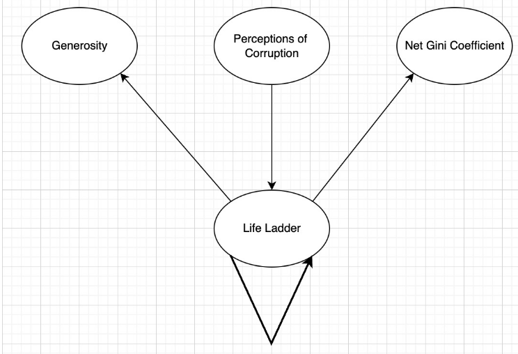
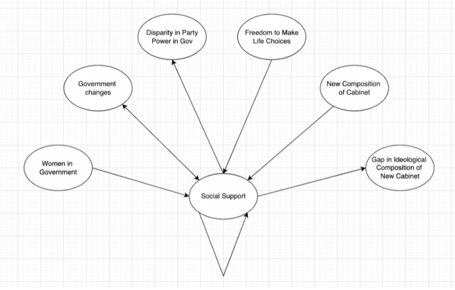
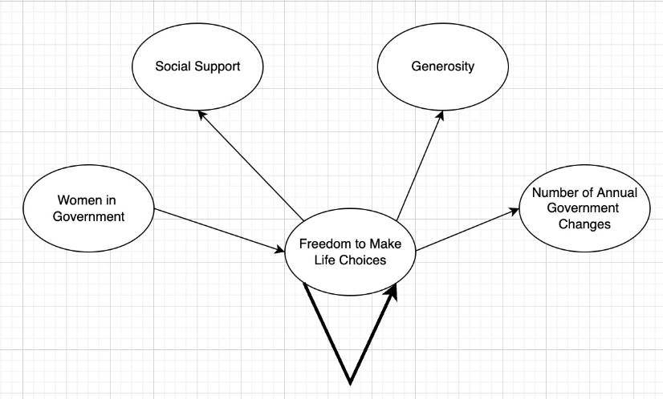

### Main Findings
To facilitate better understanding of our results, we decided to designate certain variables that we wanted to analyze as “variables of interest,” these were the following: Life Ladder, Social Support and Freedom to Make Life Choices.

Our logic was that these three variables would allow us to explore how certain governmental policy and leadership could influence how long people live, as well as how people’s individual choices could impact other variables as well.
## Life Ladder 

For the first variable, Life Ladder, the biggest connection that we witnessed was with itself, meaning there was a causal relationship between countries with a high life ladder and maintaining a high life ladder in the future. The next variable that influenced Life Ladder was Perceptions of Corruption. Since the algorithm itself doesn’t specify whether the causality is positive or negative, we plotted Life Ladder against Perceptions of Corruption to see the nature of the relationship and found that a higher Perception of Corruption was distinctly related to a lower Life Ladder. In other words, the more corruption in a country, the higher quality of life and life expectancy in that country. 

Life Ladder was also causally related towards two other variables. The first of these variables was Generosity. This meant that a higher quality of life caused people to be more generous towards others. Life Ladder also was causally related with the Gini Coefficient, which meant having a higher quality of life was causally related with Gini Coefficient. We also plotted Gini Coefficient against Life Ladder to see the nature of the relationship and saw that the higher the Life Ladder score, the lower the Gini Coefficient. This meant that a higher quality of life caused lower economic inequality.

## Social Support

Our second variable of interest was Social Support. We found that it was causally influenced by four variables other than itself (Countries with higher Social Support typically maintained a high Social Support year after year). The first variable was Women in Government. This was not too surprising to see as women are typically more liberal than men and thus more likely to support governmental policies that lead to more Social Support for people. The second and third variables were changes in the government and a new majority power in government. This essentially signaled that changing government and having new people in power leads to more Social Support. This makes sense, because people typically campaign on promises to help people and engage voters to vote for them for these reasons. Finally, Freedom to Make Life Choices was causally related with Social Support as well, meaning that if people have more freedom in a country, it causes them to enact more systems of social support.

Additionally, Social Support causally influenced several variables. The first of these was a disparity in government power. This means that higher Social Support caused the power dynamic in government to be more in favor of one party. This is likely due to the fact that countries with a higher level of social support are more likely to be happy with those who are in power in government. The second variable was a gap in the ideological composition of the new cabinet, which is similar to what was discussed in the paragraph prior.

## Freedom to Make Life Choices

Our third variable of interest was Freedom to Make Life Choices. We found that it was highly causally related with itself, meaning that countries that had higher freedoms were likely to maintain freedoms, while those who did not typically stayed in a more authoritarian environment. The one variable we were able to find that causally influenced freedom was having more women in government. On the surface, this definitely makes sense, as typically more authoritarian governments don’t have women in power, and most if not all dictators throughout history have been men.

Freedom to Make Life Choices also causally influenced three other variables. Which were Social Support, Generosity and the number of annual changes in the government (i.e. number of elections). This meant that when people were given more freedom over their own life choices, they typically chose to be more generous, and push for more Social Support in their country. It also led them to want to vote more often so that they could hold elected officials more accountable.

Putting everything together, it is apparent that certain pathways exist that can inform us how different societal measures impact our variables of interest. For instance, we can see that Corrupt governments will lead to a much lower quality of life, whereas giving people more power over their own choices will lead to higher levels of social support and generosity, which indirectly leads to a better Life Ladder (quality of life) score. 

Thus, from our results, we can deduce that the best way to set up a society for a high quality of life is to have a transparent government with frequent elections and for the government to include a representative body of people. This will generally lead to people voting for their own self-interest, which will lead to a number of positive outcomes, such as higher quality of life, more generosity among individuals, more social support, and lower economic inequality.

